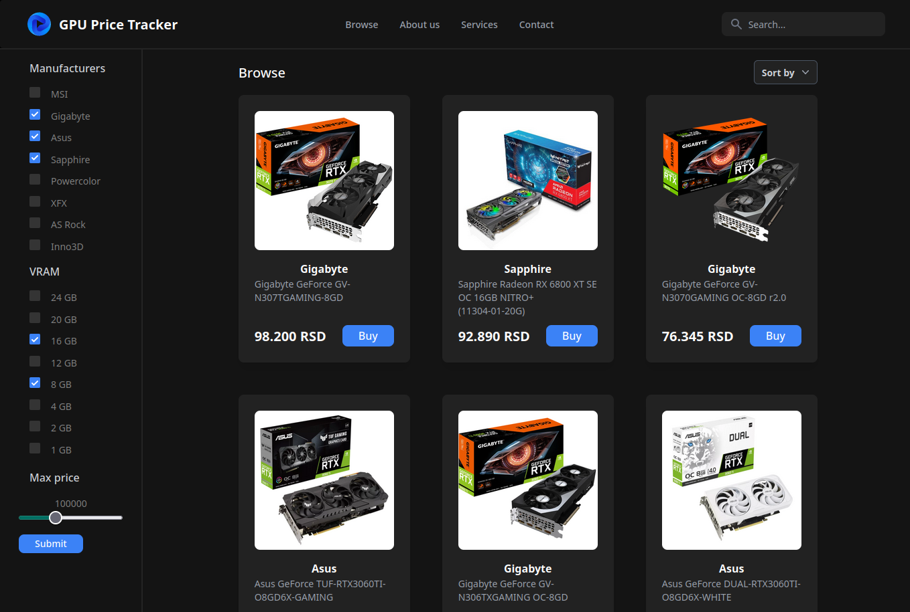

# GPU Price Tracker

## Overview

The GPU Price Tracker is a powerful web scraping and price aggregation tool built to help you find the best deals on graphics cards in the ever-fluctuating GPU market. With this project, I have leveraged Next.js 13, React, TypeScript, PostgreSQL, Docker, and Prisma ORM to create a comprehensive solution for tracking GPU prices across various retailers.



## Table of Contents

- [Technologies Used](#technologies-used)
- [Features](#features)
- [Installation and Setup](#installation-and-setup)
- [Contributing](#contributing)
- [License](#license)
- [Acknowledgments](#acknowledgments)


## Technologies Used

- **Next.js 13**: A powerful React framework for building server-rendered React applications.
- **React**: A popular JavaScript library for building user interfaces.
- **TypeScript**: A statically typed superset of JavaScript that enhances code quality and maintainability.
- **PostgreSQL**: A robust relational database management system used for efficient data storage.
- **Docker**: Containerization technology for simplified deployment and consistent environments.
- **Prisma ORM**: A modern database toolkit for TypeScript and Node.js.
- **Cheerio**: A library for parsing and manipulating HTML and XML documents.
- **Puppeteer**: A headless browser automation tool for web scraping.

## Features

- **Web Scraping**: I have implemented multiple web scraping methods, utilizing libraries like Cheerio and Puppeteer to extract GPU models and their corresponding prices from a range of online retailers. This ensures a broad coverage of GPU listings.

- **Price Aggregation**: The project aggregates the scraped data, providing you with a consolidated view of GPU prices from multiple retailers in one place. This allows you to easily compare prices and make informed purchasing decisions.

- **Next.js and React**: The front end of the GPU Price Tracker is powered by Next.js and React, providing a fast and responsive user interface for a seamless browsing experience.

- **TypeScript**: TypeScript is used throughout the project to enhance code quality, maintainability, and developer productivity.

- **PostgreSQL and Prisma ORM**: GPU data is stored efficiently in a PostgreSQL database, managed with Prisma ORM, ensuring data integrity and enabling advanced querying capabilities.

- **Docker Containerization**: The PostgreSQL database is containerized using Docker, simplifying deployment and ensuring consistent environments across different setups.

## Installation and Setup

To get started with the GPU Price Tracker, follow these steps:

1. **Clone the Repository**: Clone this GitHub repository to your local machine.

   ```bash
   git clone https://github.com/your-username/gpu-price-tracker.git
   ```

2. **Install Dependencies**: Navigate to the project directory and install the required dependencies.

   ```bash
   cd gpu-price-tracker
   npm install
   ```

3. **Set Up the Database**: Configure and set up your PostgreSQL database. Update the database connection settings in the project's configuration files.

4. **Run the Application**: Start the GPU Price Tracker application using the following command:

   ```bash
   npm run dev
   ```

5. **Access the Web Application**: Open your web browser and access the application at `http://localhost:3000`.


## Contributing

Contributions to the GPU Price Tracker project are welcome! If you'd like to contribute, please follow the [contribution guidelines](CONTRIBUTING.md).

## License

This project is licensed under the MIT License - see the [LICENSE](LICENSE) file for details.

## Acknowledgments

I want to express my gratitude to the open-source community, which provides invaluable libraries and tools that make projects like the GPU Price Tracker possible. Additionally, thank you to the various retailers for maintaining publicly accessible GPU pricing data.

Happy hunting for your affordable graphics card! 🚀

---

*Disclaimer: The GPU Price Tracker is intended for educational and informational purposes only. Be sure to adhere to all relevant laws and terms of service when using the scraping functionality. Prices and availability may change rapidly, so always verify information before making a purchase.*
